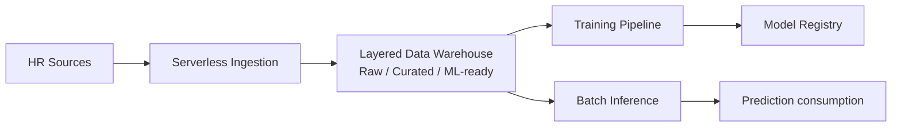
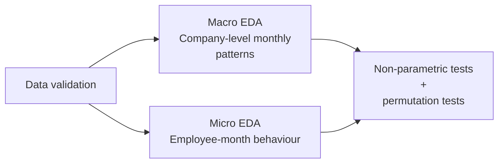
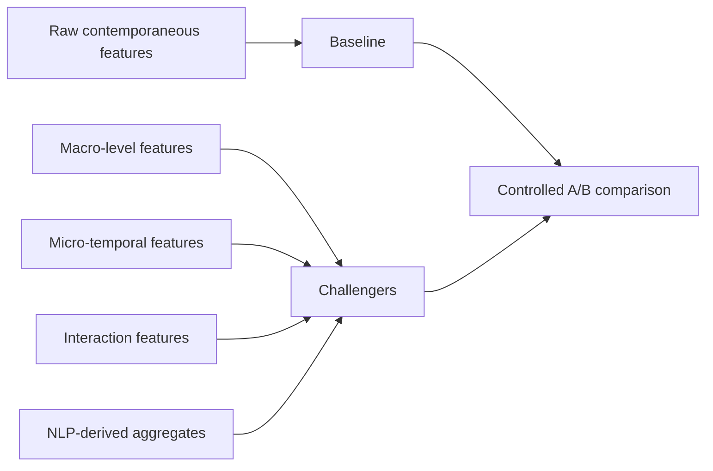
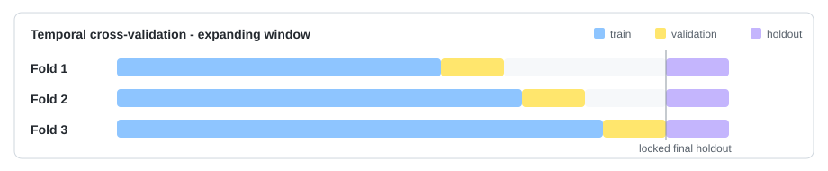
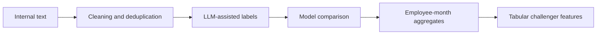

# People Analytics MLOps

> Confidentiality-safe technical case study based on a collaborative Master's Thesis project

    

Technical case study based on a collaborative Master's Thesis project focused on employee attrition prediction using tabular, temporal and unstructured data on Google Cloud Platform.

The objective was to transform periodically updated HR and operational data into an interpretable batch risk signal. The resulting predictions were conceived as decision-support information for HR, not as automated decisions about employees.

## Project Context

The use case presented several technical constraints: longitudinal employee-month observations, severe class imbalance with very few positive events, limited temporal coverage, sensitive attributes, leakage risk and mixed data types.

These constraints shaped both the modelling strategy and the MLOps architecture.

## My Contribution and Main Decisions

**Ownership**

| Area                                | Role                      |
| ----------------------------------- | ------------------------- |
| EDA and feature experimentation     | Owner                     |
| Model validation and selection      | Owner                     |
| Vertex AI training pipeline         | Owner                     |
| Explainability and fairness         | Owner                     |
| NLP exploration                     | Co-owner                  |
| Batch inference                     | Contributor               |
| Data ingestion and medallion layers | Context / downstream user |

**Selected decisions**

| Decision                                     | Rationale                                                     |
| -------------------------------------------- | ------------------------------------------------------------- |
| Temporal and permutation-based validation    | Reduced leakage and spurious-signal risk                      |
| Stability-aware model gating                 | Avoided fragile promotions                                    |
| SHAP and fairness checks before registration | Made model behaviour reviewable before downstream consumption |
| Batch inference over online serving          | Matched the business cadence and reduced serving complexity   |
| NLP kept exploratory                         | Evidence did not justify operational complexity               |

## System Architecture

The complete solution followed a layered batch architecture on Google Cloud:

The data platform used a medallion architecture. This work was implemented by other members of the team, but it provided the curated data foundation used by the ML workflows.

The training and inference processes were separated because they had different responsibilities. Training evaluated new candidates and controlled promotion, while inference loaded an approved model and generated recurring predictions without retraining it.

## Analytical Strategy - Top-down EDA

This progression was designed to quantify the incremental value of each analytical layer, avoiding both unnecessary complexity and overestimation of weak signals.

Because the aggregate time series was short and the positive class was extremely small, the analysis relied on conservative methods such as non-parametric tests, multicollinearity checks and permutation-based filtering. These techniques reduced the risk of selecting relationships that appeared meaningful only by chance.

## Feature Engineering and Experiment Configuration

**Feature engineering**

This stage translated the EDA findings into controlled modelling experiments. Raw contemporaneous variables formed the baseline, while each additional feature family was treated as a challenger and evaluated under the same A/B testing framework.

**Preprocessing**

Numerical variables were imputed and robustly scaled, while categorical and ordinal variables used dedicated encoders within the same reusable preprocessing pipeline. Given the limited number of positive cases, the approach prioritised simple transformations that preserved observations rather than aggressive filtering or synthetic resampling.

**Experimental design**

The same temporal windows, candidate algorithms, evaluation metrics and promotion rules were maintained across feature versions. This ensured that performance differences could be attributed primarily to the feature representation rather than to changes in validation or model configuration.

  

**Candidate algorithms**

  
  
  
  

All candidates used imbalance-aware configurations based on class weighting or an equivalent algorithm-specific mechanism.

**Evaluation and promotion logic**

|                  Perspective                  |                        Criteria                        |                                  Selection role                                  |
| :--------------------------------------------: | :----------------------------------------------------: | :-------------------------------------------------------------------------------: |
| Predictive quality under severe imbalance | PR-AUC, top-risk recall, top-risk precision, lift |       Measured rare-event performance and usefulness for prioritised review       |
|              Temporal robustness              |            Mean/std across expanding folds            |              Penalised candidates with unstable validation behaviour              |
|             Production suitability             |        Interpretability, operational complexity        | Favoured simpler models unless complexity delivered stable incremental value |

The resulting weighted score centralised these criteria into a reproducible gating decision. A candidate could progress only when it exceeded the current reference model under the same temporal validation setup and satisfied the minimum promotion thresholds.

## Vertex AI Training Pipeline

The offline training lifecycle was implemented as a component-based Kubeflow Pipeline executed through Vertex AI Pipelines.

Only promoted candidates reached the final evaluation stage. Before registration, the pipeline generated explainability and fairness artifacts so that model approval was tied not only to predictive performance, but also to reviewability in a sensitive HR context.

The promoted model and preprocessing artifacts became the contract consumed by the batch inference pipeline, reducing the risk of training-serving inconsistencies.

## NLP

NLP was explored as a complementary signal for the tabular attrition model. The goal was to transform internal text into employee-month aggregates such as dominant sentiment, average intensity and negative-message share.

  
  
  
  

The NLP signal showed potential as an auxiliary feature family, but the evidence depended on very few positive events, limited semantic variance and on labels derived from another model rather than from a sufficiently large human-labelled ground truth. It was therefore documented as a future line of work instead of being promoted into the production ML workflow.

## Batch Inference Integration

The use case did not require an online prediction endpoint. Source data was updated periodically, and the resulting scores were intended for an analytical business workflow rather than millisecond-level decisions.

A separate Vertex AI pipeline reused the promoted preprocessing and model artifacts, loaded the required historical context, generated employee-level probabilities and calculated the main SHAP drivers for prioritised cases.

The outputs were written to curated prediction tables for downstream business consumption.

## Representative Stack

  
  
  
  
  
  
  
  
  
  

## Future Work

| Priority                      | Direction                              | Objective                                                                                           |
| ----------------------------- | -------------------------------------- | --------------------------------------------------------------------------------------------------- |
|  | Monitoring and drift detection         | Extend observability across input data, predictions, concepts and explanation patterns              |
|  | Local fairness and explainability gate | Add local SHAP and fairness tests on prioritised high-risk cases                                    |
|  | Automated retraining lifecycle         | Define when and how new candidates should be trained, evaluated and promoted                        |
|  | Artifact and serving governance        | Strengthen model, preprocessing and inference versioning through registry-based deployment patterns |
|  | NLP productionisation path             | Turn text-derived signals into a governed enrichment pipeline if future validation supports it      |

## Outcomes

- **Business framing:** Moved the problem from periodic, subjective assessment towards recurring, quantitative and auditable risk signals.
- **Modelling evidence:** Promising results, interpreted cautiously because of limited temporal history and severe class imbalance.
- **Responsible ML:** Explainability, fairness review and data governance were treated as design requirements rather than post-training add-ons.
- **MLOps maturity:** Established reproducible training and batch inference foundations; continuous training and post-deployment monitoring remained future work.
- **Product judgement:** Kept NLP as a potential enrichment path because its operational burden was not yet supported by sufficiently robust evidence.

---

*This repository is a documentation-only technical case study. The original project was developed under a confidentiality agreement and no original data, source code, notebooks, schemas, infrastructure identifiers, model artifacts, employee-level information or exact confidential results are included.*
