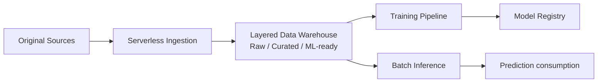
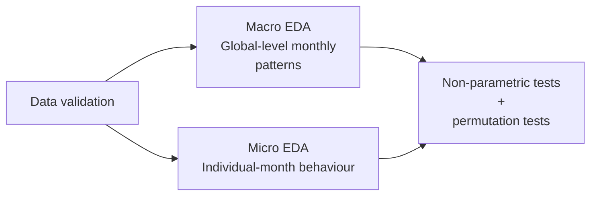
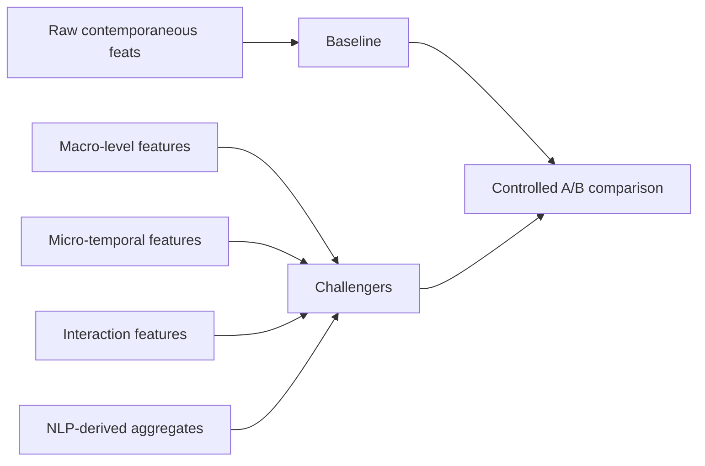

# Rare event-driven MLOps

> High-level technical case study for production-oriented ML for periodically updated data

    

Technical case study focused on rare event prediction using tabular, temporal, and unstructured data on GCP. Some parts are highly replicable in sectors such as industrial predictive maintenance, customer lifetime value, and healthcare.

The scenario's objective was to transform periodically updated data into an interpretable batch risk signal. The resulting predictions were conceived as decision-support information for management teams, not as automated black-box decisions.

The documentation explores the high-level decisions made for the system architecture, an EDA and experimental approach, the steps of an automated training pipeline, the integration of the inference pipeline, the inclusion of unstructured data, and the possible positive outcomes of similar solutions.

## Project context

Real-world rare-event prediction problems can combine several challenging characteristics, such as **repeated observations of the same entities over time, highly imbalanced targets with scarce positive events, limited historical data, potentially sensitive attributes, temporal leakage risks, and heterogeneous data sources** .

These characteristics can significantly influence both the modelling strategy and the production architecture.

## Minimum system architecture

A recommended end-to-end solution would be a layered batch architecture on Google Cloud:

The data platform could use a medallion architecture, which can provide a curated data foundation used by other ML workflows.

The training and inference processes should be separated as they have different responsibilities. Given that, in this case, latency is not a requirement, the training pipeline can take advantage of this by evaluating new candidates and controlling promotion offline. The inference pipeline then has to load the saved promoted artifacts (to avoid training-serving skew) in order to make recurring predictions.

## Analytical strategy - Top-down EDA

This progression is designed to quantify the incremental value of each analytical layer, avoiding both unnecessary complexity and overestimation of weak signals.

If the time series is short and the positive class is extremely small, the risk of selecting random relationships by chance increases considerably. Therefore, relying on conservative methods (if time and computation allow it) could involve a mix of non-parametric tests, multicollinearity checks, and permutation-based filtering as methods to reduce the risk of spurious correlations.

## Feature engineering and experiment configuration

**Feature engineering**

Following the EDA, the next steps would be to translate the findings into controlled modelling experiments. Raw contemporaneous variables should form the baseline, while each additional feature family would be treated as a challenger and evaluated under the same A/B testing framework, hence continuing with the top-down philosophy.

**Preprocessing**

Given the limited number of positive cases, the priority should be simple transformations to preserve the original observations rather than aggressive filtering or synthetic resampling.

**Experimental design**

The same temporal windows, candidate algorithms, evaluation metrics, and promotion rules have to be maintained across feature versions to ensure rigorous validation of performance rather than validation of changes in configuration.

> A possible expanding window design, enabling the quantification of the global stability of the model per experiment.

**Candidate algorithms**

  
  
  
  

Given the restrictions of the problem, efforts should not be primarily allocated to creating a sophisticated algorithm. The first main concern should be improving the representation of the data (*garbage in, garbage out*). What should be common across models is the use of class weighting or an equivalent algorithm-specific mechanism.

**Some evaluation metrics and the conceptual promotion logic**

|                  Perspective                  |                     Criteria                     |                                  Selection role                                  |
| :--------------------------------------------: | :----------------------------------------------: | :-------------------------------------------------------------------------------: |
| Predictive quality under severe imbalance | PR-AUC, top-risk recall, top-risk precision |       Measured rare-event performance and usefulness for prioritised review       |
|              Temporal robustness              |         Mean/std across expanding folds         |              Penalised candidates with unstable validation behaviour              |
|             Production suitability             |     Interpretability, operational complexity     | Favoured simpler models unless complexity delivered stable incremental value |

A weighted score is a simple way to centralise the criteria into a reproducible gating decision, resulting in the progression of a candidate only when it exceeds the current reference model under the same temporal validation setup and satisfies the minimum promotion thresholds.

## Vertex AI training pipeline

In GCP, the offline training lifecycle can be implemented as a component-based Kubeflow Pipeline executed through Vertex AI Pipelines. This offers many advantages, such as serverless execution, lower development overhead, reusable components, DAG workflows, and portability.

Continuing with the hard-filtering methodology, only promoted candidates should reach the final evaluation stage. Before registration, the pipeline has to generate explainability and fairness artifacts so that model approval is tied not only to predictive performance, but also to reviewability in a sensitive context.

## Unstructured data

In some cases, it is possible that the source can provide unstructured data to complement the tabular data. While this is a fantastic opportunity to experiment and extract more valuable signal in such a reduced-positive-class scenario, it would be best to have a strong, robust tabular training pipeline first, and then expand into this type of data.

If the unstructured data is text, a common workflow with LLM-assisted labelling (favouring speed) could be as shown below. It indicates the use of these features (from experimentation to training consumption), and the badges show the alternatives that could be tried in the GCP environment.

  
  
  

## Batch inference integration

When source data is updated periodically and the resulting scores are intended for an analytical workflow rather than millisecond-level decisions then it can be assumed that an online prediction endpoint is not required in these circumstances.

A separate Vertex AI pipeline could could reuse the promoted preprocessing and model artifacts, load the required historical context, generate period-level probabilities, and calculate the main SHAP drivers for prioritised cases.

The outputs were written to curated prediction tables for downstream business consumption.

## Representative stack

  
  
  
  
  
  
  
  
  

## Potential future improvements

| Priority                                                                                                                                    | Direction                       | Objective                                                                                                                               |
| ------------------------------------------------------------------------------------------------------------------------------------------- | ------------------------------- | --------------------------------------------------------------------------------------------------------------------------------------- |
|                                                                                                                | Monitoring and drift detection  | Extend observability across data, predictions, concepts and explanation patterns                                                        |
|                                                                                                                | Deeper fairness evaluation      | Strengthen fairness analysis across both global behaviour and prioritised local cases                                                   |
|                                                                                                                | Automated retraining lifecycle  | Define when and how new candidates should be trained, evaluated and promoted                                                            |
|                                                                                                                | Stronger artifact governance    | Improve versioning and traceability for models, preprocessing assets, and inference components                                          |
|                                                                                                                | Governed NLP productionisation  | Turn text-derived signals into a controlled enrichment pipeline if future validation supports it                                        |
|  | Experiment with survival models | Although computationally more expensive, less feature processing is needed and a continuous probability curve is native to these models |

## Expected possible outcomes

* **Business framing:** Moving the problem from periodic, subjective assessment towards recurring, quantitative, and auditable risk signals.
* **Modelling evidence:** Cautious interpretation because of limited temporal history and severe class imbalance.
* **Responsible ML:** Explainability, fairness review, and data governance have to be treated as design requirements rather than post-training add-ons.
* **MLOps maturity:** Establishing reproducible training and batch inference foundations is the bare minimum; continuous training and post-deployment monitoring should be priorities for a second work-phase sprint.
* **Product judgement:** Adding other sources could provide a potential signal-enrichment path, but their operational burden also has to be justified.

---

*This repository is a documentation-only technical case study. This blueprint is a technical abstraction derived from academic and collaborative work in the MLOps academic and professional fields. To comply with confidentiality obligations, all specific corporate contexts, data, specific architectures and results have been completely omitted. This repository serves solely to demonstrate generalizable technical patterns.*
